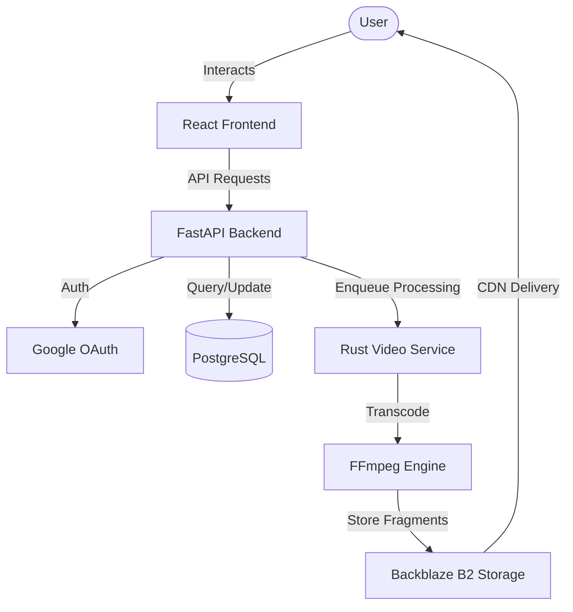

  
  <h1>Monteeq</h1>
  
<em>A high-performance, full-stack video platform designed for creators.</em>

  
  
  
  
  

<h3>
  
  Key Features
</h3>

<ul>
  <li><b>Modern UI/UX</b>: Responsive dark-mode interface built with React, Vite, and Framer Motion for smooth animations.</li>
  <li><b>Multi-Format Video Support</b>: Support for 'Home' (standard) and 'Flash' (short-form) video types.</li>
  <li><b>High-Speed Transcoding</b>: Dedicated Rust microservice for heavy video processing tasks.</li>
  <li><b>Creator Analytics</b>: Advanced performance tracking with monthly growth insights and interactive charts.</li>
  <li><b>Social Interactions</b>: Threaded comment system, likes, reposts, and real-time notifications.</li>
  <li><b>Achievement System</b>: Milestone tracking for creators to reward engagement.</li>
  <li><b>S3-Compatible Storage</b>: Seamlessly integrated with Backblaze B2 for scalable media hosting.</li>
  <li><b>Secure Authentication</b>: Google OAuth2 integration and JWT-based session management.</li>
</ul>

<h3>
  
  Tech Stack
</h3>

<table>
  <tr>
    <td><b>Frontend</b></td>
    <td>React 19, Vite, Framer Motion, Vanilla CSS, Recharts, Lucide React</td>
  </tr>
  <tr>
    <td><b>Backend</b></td>
    <td>FastAPI, Httpx, PostgreSQL, SQLAlchemy, Alembic</td>
  </tr>
  <tr>
    <td><b>Media Engine</b></td>
    <td>Rust (FFmpeg integration)</td>
  </tr>
  <tr>
    <td><b>Infrastructure</b></td>
    <td>Docker, Docker Compose, Backblaze B2 (S3-API)</td>
  </tr>
</table>

<h3>
  
  Platform Vision
</h3>

Monteeq is built to redefine what a creator platform looks and feels like. We believe in providing an ultra-premium, cinematic experience—affectionately stylized as the **"Gilded Obsidian"** design system—that empowers creators to monetize effectively while engaging audiences in a hyper-optimized ecosystem.

**Key Ecosystem Highlights:**
- **Creator Monetization**: An embedded 'Monetization Widget' providing seamless tipping, premium subscriptions, and milestone-based community rewards.
- **Trophy Room & Gamification**: Interactive public profiles highlighting a creator's successes, challenge wins, and top-tier metrics to boost audience trust and engagement.
- **Performance Administration**: Detailed analytics tracking platform-wide growth curves, ensuring community administrators can maintain community health in real time.
- **Architectural Scalability**: Decoupling resource-heavy media transcoding into a specialized async Rust engine ensures that the FastAPI business layer remains consistently responsive, regardless of concurrent uploads.

<h3>
  
  Architecture
</h3>

  
This project is licensed under the MIT License - see the <a href="LICENSE">LICENSE</a> file for details.

  
  
<em>Made for the Creative Community</em>

